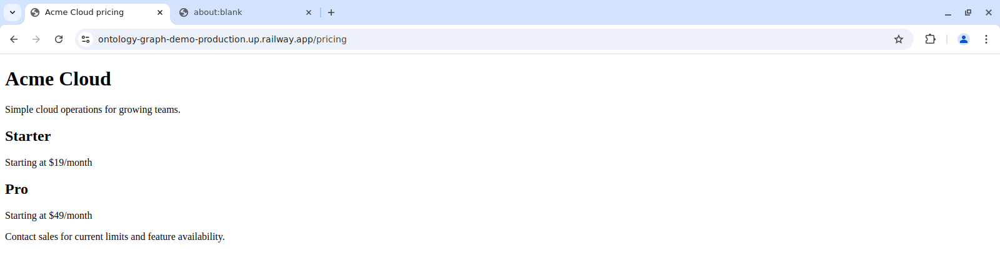
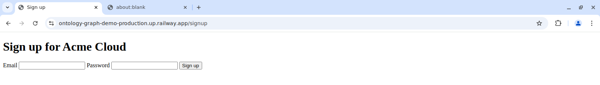
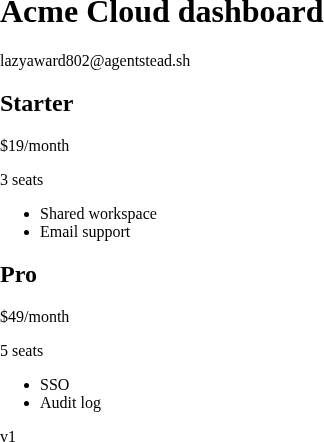
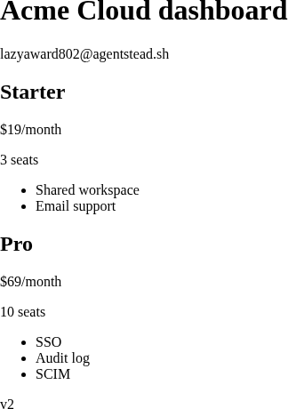
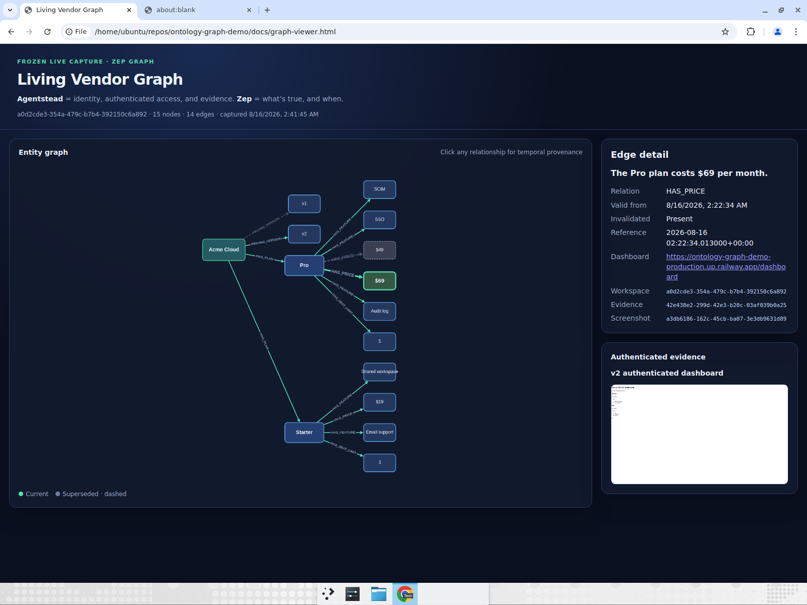

# Living Vendor Graph

A practical guide to authenticated vendor observation, evidence capture, and temporal graph memory
with Agentstead and Zep.

## Authenticated Observation, Evidence, and Temporal Truth

This guide explains why vendor monitoring breaks when an agent can only read public pages, what a
durable workspace identity changes, and how to run a before-and-after demo that makes the
difference concrete. The demo signs an agent up to a SaaS target, verifies its own email, reads the
authenticated dashboard, stores the evidence, and sends the observation to a temporal graph. Then
the vendor changes its pricing and the agent does it again.

Every command, screenshot, timestamp, and identifier below comes from real runs against a deployed
target.

## Why Authenticated Vendor Monitoring Is Hard

Most competitive-intelligence tooling was designed for two kinds of readers:

1. A crawler fetching public documents
2. A human with an account, reading a dashboard by hand

That model breaks once you want an agent to track what is true inside a product over time. The
public page usually omits the facts you care about, and the crawler has no account, no inbox, and
no way to come back later as the same user. That makes it hard to answer basic questions like:

- Where exactly did this fact come from?
- When did it stop being true?
- Can the same agent check again next week without a human logging it in?

In this guide we'll refer to the following terms:

- An **observation** is a structured snapshot of vendor facts, captured at a specific time from a
  specific URL.
- **Evidence** is the raw material behind an observation: the page read the agent performed and the
  screenshot it took, stored immutably.
- A **temporal edge** is a graph relationship with a validity interval, such as
  `Pro –HAS_PRICE→ $49` valid from one timestamp to another.
- **Invalidation** means marking a fact as no longer true, with the time it stopped being true,
  instead of overwriting it.
- A **workspace identity** is the agent's durable account context: its own mailbox, browser
  profile, credentials, files, and activity log.

| What goes wrong | Why the old way fails | What this demo adds |
| --- | --- | --- |
| Facts are unavailable | Public pricing pages omit seat limits, feature availability, and version, so the crawler never sees them. | The agent holds an account and reads the authenticated dashboard. |
| No provenance | A scraped number is a number. There is no way to show what page produced it. | Every observation carries the URL, workspace, page-read file ID, and screenshot file ID. |
| Overwrites destroy history | A key-value store replaces `$49` with `$69` and the old fact is gone. | The graph invalidates the old edge with a timestamp and keeps it queryable. |
| No continuity | Each run starts from a blank browser and cannot get back into the account. | A persistent browser profile means a new session is still logged in. |

## What the Demo Does and How It Works

The sequence is:

1. The agent gets a workspace identity: a real inbox, a persistent browser profile, and a
   credential vault.
2. It signs up to the target using its workspace email and a credential Agentstead generates and
   fills server-side.
3. It waits for the verification email in its own inbox and follows the extracted link.
4. It reads the authenticated dashboard by CSS selector and parses the plan facts.
5. It writes the raw page read and a screenshot to workspace files, then builds an observation that
   references both file IDs.
6. It appends the observation to a local JSONL ledger and sends it to Zep as a timestamped episode.
7. It closes the browser session.
8. The vendor's pricing changes.
9. A new browser session reconnects to the same profile, is still authenticated, and observes again.
10. Zep invalidates the superseded facts. The CLI and a static viewer show what changed, when, and
    on what evidence.

Three layers are responsible for three different questions:

| Layer | What it answers |
| --- | --- |
| Ontology / context graph | What exists? How is it related? What is true now? |
| Agent framework | What should the agent do next? |
| Agentstead | Who is the agent? What can it access? Can it return later? What did it do? |

The boundary matters for the implementation: Agentstead is not used as a graph database. It does
not store nodes, edges, embeddings, or graph queries. It supplies identity, authenticated access,
supervised browser operations, evidence files, and an activity trail. The graph stays in Zep.

## The Target, the Client, and the Sinks

- The **vendor target** (`src/vendor/`) is a deterministic Express app called Acme Cloud. It has a
  vague public pricing page, an authenticated dashboard, two pricing versions, and an admin
  endpoint that switches between them.
- The **Agentstead client** (`src/agentstead/client.ts`) is a typed HTTP client over the Agentstead
  API: workspaces, identity, credentials, browser sessions, page operations, mail waits, and files.
- The **orchestrator** (`src/orchestrator/cli.ts`) runs `observe`, `flip`, `diff`, and `demo`.
- The **sinks** (`src/graph/`) are the append-only JSONL ledger and the Zep graph. The ledger is the
  record; the graph is a queryable view over it.

## Using the Demo

By the end, you'll have:

- A deployed Acme Cloud target with two pricing versions
- One Agentstead workspace with a verified vendor account and stored evidence
- A Zep graph where the old price is invalidated rather than overwritten
- A static viewer that renders the temporal graph with provenance on each edge

A quick note before running the demo: workspace IDs, credential IDs, file IDs, and timestamps are
generated at runtime and will differ from the examples below.

### Prerequisites

- Node.js 22
- An Agentstead API key
- A Zep Cloud API key (optional; without it the run uses the local file sink)
- An AgentMail API key for the target's outbound verification mail

```
git clone https://github.com/thenoahhein/ontology-graph-demo
cd ontology-graph-demo
npm install
npm run build
```

### Step 1: Build the Target That Only Tells the Truth After Login

`GET /pricing` is public and intentionally incomplete:



It gives a "starting at" price and nothing else. No seat limit, no feature list, no version. This is
what a crawler sees.

The authenticated dashboard renders from a typed catalog with two versions:

```ts
export const CATALOG: Record<PricingVersion, PricingCatalog> = {
  v1: {
    version: 'v1',
    plans: {
      starter: { name: 'Starter', monthlyPrice: 19, seatLimit: 3, features: ['Shared workspace', 'Email support'] },
      pro:     { name: 'Pro',     monthlyPrice: 49, seatLimit: 5, features: ['SSO', 'Audit log'] },
    },
  },
  v2: {
    version: 'v2',
    plans: {
      starter: { name: 'Starter', monthlyPrice: 19, seatLimit: 3, features: ['Shared workspace', 'Email support'] },
      pro:     { name: 'Pro',     monthlyPrice: 69, seatLimit: 10, features: ['SSO', 'Audit log', 'SCIM'] },
    },
  },
};
```

Starter is identical in both versions. That is deliberate: it gives the diff a stable plan next to
the changed one, so you can confirm the graph is not re-asserting everything it sees.

Every fact on the dashboard gets a stable ID, plus a JSON blob used as a cross-check:

```ts
`<h2 id="plan-${plan.key}-name">${plan.name}</h2>
 <p  id="plan-${plan.key}-price">$${plan.monthlyPrice}/month</p>
 <p  id="plan-${plan.key}-seats">${plan.seatLimit} seats</p>
 <ul id="plan-${plan.key}-features">${plan.features.map((f) => `<li>${f}</li>`).join('')}</ul>`
// ...
`<p id="pricing-version">${catalog.version}</p>
 <script type="application/json" id="plan-json">${json}</script>`
```

Signup requires a shared secret and verification mail is sent through AgentMail, so the target
behaves like a real product: no account, no dashboard.

### Step 2: Give the Agent a Workspace Identity

```ts
let workspace = state
  ? await client.getWorkspace(state.workspaceId)
  : await client.createWorkspace(`Living Vendor Graph ${Date.now()}`);
if (workspace.status !== 'ready') workspace = await client.waitForWorkspaceReady(workspace.id);

const identity = await client.getIdentity(workspace.id);
```

Output:

```
Agentstead workspace 60bc65ca-e0f5-49c8-b505-02d6360d32c9 (poisedresource475@agentstead.sh)
```

A ready workspace has three things the graph cannot supply for itself: an inbox at a real domain, a
persistent browser profile, and a credential vault scoped to that identity.

The `waitForWorkspaceReady` reassignment is required, not cosmetic. Workspace creation returns
immediately with a placeholder `@workspaces.invalid` address while the mailbox is still
provisioning. Signing up with that value produces an account whose verification email goes nowhere.

The browser is supervised. The client never receives a CDP URL and never drives Playwright itself.
It requests page operations by name, each bound to an origin:

```ts
const session = await client.connectBrowser(workspace.id, { reuse: true });
await client.navigatePage(session.id, `${vendor}/signup?secret=${signupSecret}`);
await client.fillPage(session.id, vendor, [{ selector: '#email', value: identity.email_address }]);
await client.waitForSelector(session.id, '#pending', 60_000, vendor);
const read = await client.readPage(session.id, dashboardSelectors(), vendor);
const shot = await client.screenshotPage(session.id, vendor, true);
```

### Step 3: Sign Up and Verify

```ts
await client.navigatePage(sessionId, `${vendor}/signup?secret=${signupSecret}`);
await client.fillPage(sessionId, vendor, [{ selector: '#email', value: email }]);

const credential = await client.createCredential(workspaceId, {
  label: `acme-cloud-${Date.now()}`,
  site: vendor,
  username: email,
  generate: true,          // Agentstead generates the secret
  secretLength: 24,
});

await client.fillCredential(
  sessionId, credential.id,
  [{ field: 'password', selector: '#password' }],
  '#signup-submit',
);
```



`fillCredential` is the important call. The orchestrator never generates, sees, stores, or logs the
password. It passes a credential ID, a field name, and a CSS selector; the secret is injected
server-side into that origin only, and the form is submitted. The agent's process memory never
contains the secret, so a prompt-injected agent cannot leak what it does not hold.

Verification uses the workspace inbox:

```ts
const mailSince = Date.now() - 5_000;
await client.fillCredential(sessionId, credential.id, [...], '#signup-submit');
await client.waitForSelector(sessionId, '#pending', 60_000, vendor);

const mail = await client.waitForMail(workspaceId, {
  subjectContains: 'Acme Cloud verification',
  since: mailSince,
  timeoutMs: 120_000,
});
if (mail.message !== null && !isFreshMessage(mail.message.timestamp, mailSince)) {
  throw new Error('Verification email was older than the signup boundary');
}
await client.navigatePage(sessionId, mail.extraction.links[0].url);
```

Two details are load-bearing:

- `mail.extraction` returns structured links with confidence scores and a `matches_sender_domain`
  flag, plus codes for OTP-style flows. The agent does not regex a raw HTML body and hope the first
  `https://` it finds is not a tracking pixel.
- `since` bounds the wait to the current signup. A durable inbox accumulates history, and "the most
  recent email matching this subject" is not the same question as "the email caused by the action I
  just took." See the failure modes section; this one broke a run.

### Step 4: Read the Authenticated Dashboard

```ts
export function dashboardSelectors(): string[] {
  return [
    '#pricing-version', '#plan-json',
    '#plan-starter-name', '#plan-starter-price', '#plan-starter-seats', '#plan-starter-features',
    '#plan-pro-name', '#plan-pro-price', '#plan-pro-seats', '#plan-pro-features',
  ];
}
```

This is the `v1` screenshot the agent captured and filed as evidence:



The parser treats the visible selectors as authoritative and the JSON blob as an optional
cross-check. A missing or unparseable blob does not fail a valid visible parse. A well-formed blob
that disagrees with the visible page does:

```ts
if (!isDashboardData(parsed)) throw new Error('Dashboard JSON blob had an unexpected shape');
if (!dashboardDataMatches(parsed, visible)) {
  throw new Error('Dashboard JSON blob disagreed with visible plan selectors');
}
```

That rule caught a real bug on the first live run. A supervised page read returns the text content
of the matched element, so a feature list arrives as one concatenated string:

```json
{ "selector": "#plan-pro-features", "found": true, "text": "SSOAudit logSCIM" }
```

Comparing that to `["SSO","Audit log","SCIM"]` by equality fails on a page that is perfectly fine.
Compare semantically instead, then keep the structured features once the sources agree:

```ts
function compactFeatures(features: string[]): string {
  return features.join('').replace(/\s+/g, '').toLowerCase();
}
```

### Step 5: Store the Evidence Before the Facts

The raw material is written to workspace files under unique, timestamped paths first:

```ts
const rawFile        = await client.createFile(workspace.id, rawPath, 'application/json', /* page read */);
const screenshot     = await client.screenshotPage(session.id, vendor, true);
const screenshotFile = await client.createFile(workspace.id, shotPath, 'image/png', screenshot.image_base64);
```

Only then is the observation assembled, with the file IDs in its provenance:

```json
{
  "observed_at": "2026-08-16T02:22:18.501Z",
  "source": {
    "kind": "authenticated_page",
    "url": "https://ontology-graph-demo-production.up.railway.app/dashboard",
    "workspace_id": "a0d2cde3-354a-479c-b7b4-392150c6a892",
    "evidence_file_id": "8d288735-f022-482f-83a1-6919b5165f07",
    "screenshot_file_id": "31fa45c0-678e-461e-862a-a226b7335767"
  },
  "company": "Acme Cloud",
  "product": "Acme Cloud",
  "plans": [
    { "plan": "Starter", "monthly_price": 19, "seat_limit": 3,  "features": ["Shared workspace", "Email support"] },
    { "plan": "Pro",     "monthly_price": 49, "seat_limit": 5,  "features": ["SSO", "Audit log"] }
  ],
  "pricing_version": "v1"
}
```

Every value in that document traces to a file you can download.

Agentstead activity events intentionally omit page-read text and email bodies. Activity is a trigger
stream and an audit trail, not a content store. The division of labour is: activity records that
something happened, the orchestrator captures what was seen, workspace files hold the raw proof, and
the graph receives the structured copy.

The audit trail is useful on its own. This is a real activity stream from a workspace whose mailbox
provisioning failed, which identifies the broken component without reading application logs:

```json
{"type":"workspace.created",             "data":{"status":"provisioning"}}
{"type":"mailbox.failed",                "data":{"error_code":"permission_denied","provider":"agentmail"}}
{"type":"browser_profile.ready",         "data":{"provider":"browserbase"}}
{"type":"workspace.provisioning_retry",  "data":{"components":["mailbox"],"enqueued":["mailbox"]}}
{"type":"mailbox.failed",                "data":{"error_code":"permission_denied","provider":"agentmail"}}
```

### Step 6: Send the Observation to Zep

Declare the ontology before writing anything:

```ts
const entityTypes = {
  Company: { fields: { company_name: entityFields.text('The company name.') } },
  Plan:    { fields: { plan_name:    entityFields.text('The plan name.') } },
  Price:   { fields: { amount:       entityFields.integer('The monthly price in whole currency units.') } },
  Evidence: { fields: {
    url:                entityFields.text('The authenticated page URL.'),
    evidence_file_id:   entityFields.text('The raw read evidence file ID.'),
    screenshot_file_id: entityFields.text('The screenshot evidence file ID.'),
  } },
  // Product, Feature ...
};

const edgeTypes = {
  HAS_PRICE:    { fields: { monthly_price: entityFields.integer('The monthly price.') },
                  sourceTargets: [{ source: 'Plan', target: 'Price' }] },
  SUPPORTED_BY: { sourceTargets: [{ source: 'Plan', target: 'Evidence' }] },
  // OFFERS, HAS_PLAN, HAS_FEATURE ...
};
```

Zep reserves a set of field names, including `name`, `summary`, `created_at`, `uuid`, and
`group_id`. Declaring an entity field called `name` fails with `name cannot use a reserved name`.
That is why the fields are `company_name`, `plan_name`, and `feature_name`.

Ingestion is one call. The critical argument is the timestamp:

```ts
await this.client.graph.add({
  graphId: this.graphId,               // the Agentstead workspace ID
  type: 'json',
  data: JSON.stringify(observation),
  createdAt: observation.observed_at,  // when the fact was true, not when it was uploaded
  sourceDescription: 'Authenticated Acme Cloud pricing dashboard observation',
  metadata: { pricing_version, evidence_file_id, screenshot_file_id, /* ... */ },
});
```

Using the workspace ID as the graph namespace gives one durable research agent one graph, with every
fact attributable to evidence files in the same workspace.

Extraction is asynchronous. Immediately after `graph.add` returns, a search may show only an
unprocessed episode, so the CLI polls for the facts it expects and degrades explicitly:

```ts
try {
  result = await sink.waitForSearch('Acme Cloud', (value) => hasZepFacts(value, expectedFacts));
} catch (error) {
  if (!(error instanceof ZepSearchTimeoutError)) throw error;
  console.log('Zep is still processing; rendering the edges currently available.');
  result = await sink.search('Acme Cloud');
}
```

Match on plan name and price amount, not on an exact sentence. Zep writes facts in generated natural
language, so `The Pro plan costs $49 per month.` is not a template you control:

```ts
facts.some((fact) => fact.includes(planText) && fact.includes(amountText));
```

### Step 7: Change the Vendor's Pricing

```bash
npm run flip -- v2
```

Output:

```json
{"version":"v2","catalog":{"version":"v2","plans":{"starter":{"name":"Starter","monthlyPrice":19,
"seatLimit":3,"features":["Shared workspace","Email support"]},"pro":{"name":"Pro","monthlyPrice":69,
"seatLimit":10,"features":["SSO","Audit log","SCIM"]}}}}
```

The public page does not change:


It still reads "Starting at $49/month". A public-page crawler reports no change at all. This is the
reason the authenticated path exists.

### Step 8: Observe Again in a New Browser Session

```bash
npm run observe
```

Between the two observations the browser session was closed; the first run ends with
`closeBrowser(session.id)` in a `finally` block. The second run opens a new session against the same
durable profile, checks `/account`, finds itself authenticated, and skips signup:

```ts
const accountPage = await client.navigatePage(session.id, `${vendor}/account`);
const accountRead = await client.readPage(session.id, ['#authenticated'], vendor);
loggedIn = accountRead.selectors.some((s) => s.selector === '#authenticated' && s.found);
```

Output:

```
Agentstead workspace 60bc65ca-e0f5-49c8-b505-02d6360d32c9 (poisedresource475@agentstead.sh)
Observed v2; evidence 185d1e37-06df-4b7e-ad35-3eb8ce495253; screenshot 4bec7261-8366-4e90-b4ff-8803f9bfa4fe
```

No second signup, no second credential, no second verification email. The activity stream for that
session shows `/account` returning `Acme Cloud account` with `#authenticated` found, then
`/dashboard`. The agent reads the updated dashboard:



`$69/month`, `10 seats`, `SCIM`, and a second evidence pair filed in the same workspace.

### Step 9: Ask What Changed

```bash
npm run diff
```

Output (evidence IDs are from the repeat run described below):

```
Acme Starter Plan ──costs──> $19/month  valid 2026-08-16 → present
  seats: 3; features: Shared workspace, Email support; evidence: d1c0865d-…, screenshot: 8dc23c0c-…
Acme Pro Plan ──costs──> $49/month  valid 2026-08-16 → 2026-08-16
  seats: 5; features: SSO, Audit log; evidence: d1c0865d-…, screenshot: 8dc23c0c-…
Acme Pro Plan ──costs──> $69/month  valid 2026-08-16 → present
  seats: 10; features: SSO, Audit log, SCIM; evidence: 185d1e37-…, screenshot: 4bec7261-…
```

That view is computed from the ledger. The graph holds the same change as temporal edges:

```text
Pro –HAS_PRICE→ $49   "The Pro plan costs $49 per month."
                      validAt   2026-08-16T02:22:18.501Z
                      invalidAt 2026-08-16T02:22:34Z

Pro –HAS_PRICE→ $69   "The Pro plan costs $69 per month."
                      validAt   2026-08-16T02:22:34Z
                      invalidAt —
```

The orchestrator did not compute that invalidation. It sent two timestamped observations and Zep
determined that the second superseded the first.

### Step 10: View the Graph

```bash
npm run graph:view
```

The viewer is a static page generated from a frozen capture of the live graph, not a live query UI.
Superseded edges are grey and dashed; current edges are solid:



Clicking the dead `$49` edge resolves the episode it came from and shows the provenance: the
authenticated URL, the workspace ID, both evidence file IDs, and the screenshot taken while the fact
was true.


The temporal styling reads directly off the graph's validity interval:

```ts
{ dead: edge.invalidAt ? 'true' : 'false' }
// edge[dead = "true"] -> grey, dashed, faded
```

## Running It Twice: What Extraction Does Not Guarantee

In the run shown above, both observations recorded the seat limit correctly. The v2 evidence file
contains `"seat_limit": 10` and the screenshot reads `10 seats`. Zep's extraction produced a
`HAS_SEAT_LIMIT` edge only for `5` and never created the `10` edge, so that fact was never
superseded. Price and pricing version were invalidated correctly; the seat limit was not.

Running the identical sequence again, with the same code and the same target but a different
workspace and a fresh graph, produced a different result:

```text
Pro –HAS_PRICE→ $49         invalidAt 2026-08-16T03:17:41Z   (superseded, as before)
Pro –HAS_PRICE→ $69         current
Pro –HAS_SEAT_LIMIT→ 10     current      <- created this time
                                         <- no HAS_SEAT_LIMIT→5 edge was created at all
Starter –HAS_SEAT_LIMIT→ 3  current      <- also new; absent from the first run
```

The second run also produced a duplicate, partly mislabelled version edge. Alongside the correct
`PRICING_VERSION → v1` (invalidated at `03:17:41Z`), it created a `HAS_PRICING_VERSION` edge whose
target node is `v1` but whose fact text reads "Acme Cloud uses pricing version v2."

Two runs, identical structured input, two different graphs. Plan for this: what gets promoted from
an episode to an edge is not guaranteed to be exhaustive or stable, even when the payload is
complete, typed, and unambiguous. A declared ontology biases extraction; it does not make it
deterministic.

The layer underneath is deterministic. `diff` is computed from the append-only ledger rather than
the graph, so it reads the same both times. That is the practical argument for keeping evidence and
graph separate: the graph is a queryable, semantic, temporal view, and the ledger plus workspace
files are the record. A missing edge is a re-extraction problem, not lost data. If your application
depends on a specific fact being present, assert on it and re-ingest.

## Known Failure Modes

Each of these cost real debugging time during the build.

- **Workspace names become mailbox display names.** Naming a workspace
  `Living Vendor Graph 2026-08-16T02:22:18.501Z` made every mailbox provisioning attempt fail,
  because AgentMail rejects `:` in a display name. The workspace still came up with a working
  browser profile and a `@workspaces.invalid` address, so the failure surfaced later as a confusing
  signup bug. Use `Date.now()` rather than `toISOString()`.
- **A lookback window is not a lower bound.** A repeat run signed up in a workspace whose inbox
  already held a verification email from about 50 minutes earlier. The wait was called with
  `lookback_ms: 30000` and returned the stale message anyway. The agent navigated a dead token,
  landed on "Invalid link", and failed several steps later on an unauthenticated dashboard.
  Reproduced against the API: with `lookback_ms: 30000` and no `since`, the wait resolves with a
  message timestamped 50 minutes earlier; with an explicit `since`, it times out correctly. Pass
  `since` and reject a message older than that boundary.
- **Stored credentials can outlive the account.** The target's user store does not survive a
  redeploy, so a credential in the vault kept pointing at an account that no longer existed. Verify
  authentication after login and fall back to signup once instead of proceeding to a dashboard read
  that cannot succeed.
- **Report the real failure.** Reading an unauthenticated page with dashboard selectors originally
  reported `missing usable #pricing-version`, which blames the page shape for an auth problem. Check
  for the unauthenticated page first and say so.
- **Do not guess an SDK's response shape.** The first version of the renderer expected fields named
  `observations`, `startAt`, and `endAt`. The live response uses `edges[].fact`, `validAt`,
  `invalidAt`, and `episode_reference_time`. One real call settles it.

## Reference

Commands:

```bash
npm start            # run the vendor target locally
npm run observe      # signup or login, authenticated read, evidence, ledger, graph
npm run flip -- v2   # switch the target's pricing version
npm run diff         # temporal edge story with provenance, from the ledger
npm run graph:view   # regenerate docs/graph-viewer.html from a capture
npm run demo         # observe, flip, observe, diff
```

Environment:

| Variable | Used by | Purpose |
| --- | --- | --- |
| `AGENTSTEAD_API_KEY` | orchestrator | Workspace identity, browser, mailbox, credentials, files |
| `ZEP_API_KEY` | orchestrator | Temporal graph; omit to use the local JSONL sink |
| `VENDOR_BASE_URL` | orchestrator | The target to observe |
| `SIGNUP_SHARED_SECRET` | both | Guards the target's signup route |
| `ADMIN_SECRET` | both | Guards the pricing-version endpoint |
| `AGENTMAIL_API_KEY` | target | Sends verification mail |

`npm run demo` runs the full sequence. Without `ZEP_API_KEY` the local JSONL sink is selected
automatically, so everything except the graph works offline. Local setup is documented in
[`docs/DEMO.md`](../DEMO.md).

## Summary

The graph does not own identity, sessions, or secrets. Agentstead does not own nodes, edges, or
queries. The orchestrator owns neither: it moves a well-shaped observation from a system that can
log in to a system that can remember.

A context graph can record that a vendor offers SSO. A workspace identity is what lets an agent hold
the account that logged in, verify the claim, notice when it changed, and show the page that proves
it.

Source: [thenoahhein/ontology-graph-demo](https://github.com/thenoahhein/ontology-graph-demo). The
viewer data is a capture of a live Zep graph produced by the run described above. The screenshots
are the agent's own evidence files and the deployed target.
